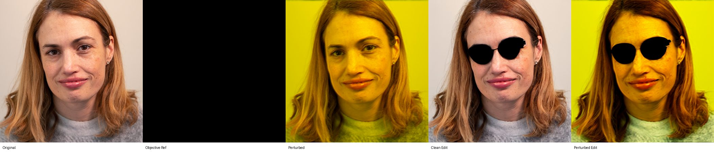
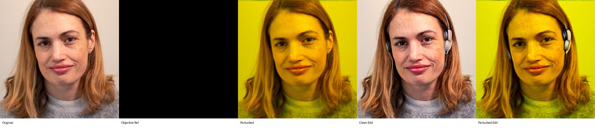
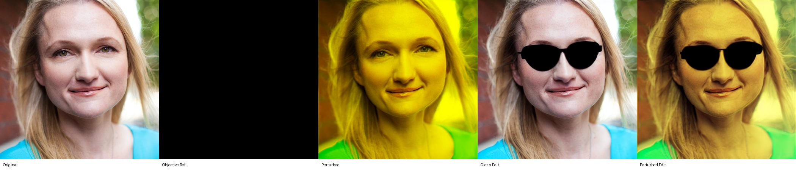
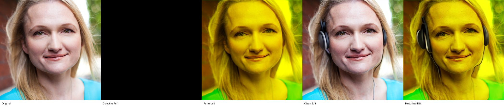
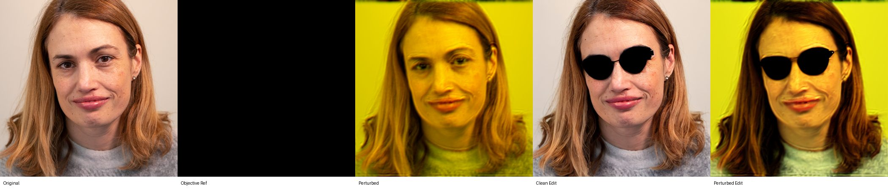
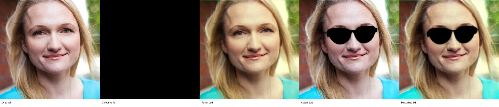
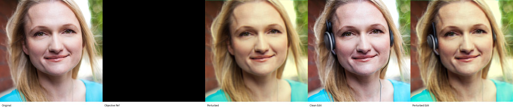

# WOOD: InstructPix2Pix White-box Geometry Results

Combined differentiable perturbation results

Author: Parth Katiyar

## Method

WOOD optimizes `Z` with `loss = -Z`. Model weights are frozen; only differentiable perturbation parameters are optimized.

## Run matrix

| model | code objective | objective | cases | iterations | status |
| --- | --- | --- | --- | --- | --- |
| InstructPix2Pix | vae_conditioning | VAE conditioning latent | 4.0000 | 150.00 | done |
| InstructPix2Pix | unet_prediction | UNet denoising prediction | 4.0000 | 150.00 | done |

## Aggregate summary

| model | objective | runs | mean final Z | mean SSIM original | mean output SSIM | mean output L2 |
| --- | --- | --- | --- | --- | --- | --- |
| InstructPix2Pix | VAE conditioning latent | 4.0000 | 150.47 | 0.5675 | 0.4973 | 0.2854 |
| InstructPix2Pix | UNet denoising prediction | 4.0000 | 0.0030 | 0.7988 | 0.6209 | 0.1778 |

## Per-run final values

| objective | face | prompt | final Z | final loss | SSIM original | output SSIM | output L2 | max disp px |
| --- | --- | --- | --- | --- | --- | --- | --- | --- |
| VAE conditioning latent | face_002 | add black sunglasses | 148.57 | -148.57 | 0.6374 | 0.4627 | 0.2880 | 14.236 |
| VAE conditioning latent | face_002 | add headphones | 149.34 | -149.34 | 0.6332 | 0.4175 | 0.2996 | 17.127 |
| VAE conditioning latent | face_005 | add black sunglasses | 151.99 | -151.99 | 0.5001 | 0.6479 | 0.2107 | 26.987 |
| VAE conditioning latent | face_005 | add headphones | 151.98 | -151.98 | 0.4992 | 0.4611 | 0.3433 | 24.529 |
| UNet denoising prediction | face_002 | add black sunglasses | 0.0028 | -0.0028 | 0.6210 | 0.4207 | 0.2788 | 5.6732 |
| UNet denoising prediction | face_002 | add headphones | 0.0028 | -0.0028 | 0.6304 | 0.3993 | 0.3013 | 6.5670 |
| UNet denoising prediction | face_005 | add black sunglasses | 0.0031 | -0.0031 | 0.9707 | 0.8473 | 0.0603 | 5.7349 |
| UNet denoising prediction | face_005 | add headphones | 0.0032 | -0.0032 | 0.9732 | 0.8163 | 0.0708 | 5.6206 |

## Image strips

### VAE conditioning latent / face_002 / add black sunglasses

### VAE conditioning latent / face_002 / add headphones

### VAE conditioning latent / face_005 / add black sunglasses

### VAE conditioning latent / face_005 / add headphones

### UNet denoising prediction / face_002 / add black sunglasses

### UNet denoising prediction / face_002 / add headphones

### UNet denoising prediction / face_005 / add black sunglasses

### UNet denoising prediction / face_005 / add headphones

## Graphs

### VAE conditioning latent

#### VAE conditioning latent: Z vs iteration

#### VAE conditioning latent: loss vs iteration

#### SSIM and PSNR to original

#### Geometry component contribution

#### Geometry component contribution normalized

### UNet denoising prediction

#### UNet denoising prediction: Z vs iteration

#### UNet denoising prediction: loss vs iteration

#### SSIM and PSNR to original

#### Geometry component contribution

#### Geometry component contribution normalized

