# WOOD: InstructPix2Pix White-box Geometry Results

Combined differentiable perturbation results

Author: Parth Katiyar

## Method

WOOD optimizes `Z` with `loss = -Z`. Model weights are frozen; only differentiable perturbation parameters are optimized.

## Run matrix

| model | code objective | objective | cases | iterations | status |
| --- | --- | --- | --- | --- | --- |
| InstructPix2Pix | vae_conditioning | VAE conditioning latent | 4.0000 | 500.00 | done |
| InstructPix2Pix | unet_prediction | UNet denoising prediction | 4.0000 | 500.00 | done |

## Aggregate summary

| model | objective | runs | mean final Z | mean SSIM original | mean output SSIM | mean output L2 |
| --- | --- | --- | --- | --- | --- | --- |
| InstructPix2Pix | VAE conditioning latent | 4.0000 | 130.21 | 0.9653 | 0.7653 | 0.0717 |
| InstructPix2Pix | UNet denoising prediction | 4.0000 | 0.0026 | 0.9947 | 0.8719 | 0.0369 |

## Per-run final values

| objective | face | prompt | final Z | final loss | SSIM original | output SSIM | output L2 | max disp px |
| --- | --- | --- | --- | --- | --- | --- | --- | --- |
| VAE conditioning latent | face_002 | add black sunglasses | 127.82 | -127.82 | 0.9888 | 0.8365 | 0.0458 | 8.5114 |
| VAE conditioning latent | face_002 | add headphones | 127.65 | -127.65 | 0.9957 | 0.8687 | 0.0407 | 2.7088 |
| VAE conditioning latent | face_005 | add black sunglasses | 131.57 | -131.57 | 0.9554 | 0.7268 | 0.0872 | 35.217 |
| VAE conditioning latent | face_005 | add headphones | 133.78 | -133.78 | 0.9213 | 0.6293 | 0.1130 | 46.299 |
| UNet denoising prediction | face_002 | add black sunglasses | 0.0024 | -0.0024 | 0.9961 | 0.8797 | 0.0362 | 2.1972 |
| UNet denoising prediction | face_002 | add headphones | 0.0024 | -0.0024 | 0.9952 | 0.8550 | 0.0395 | 3.2537 |
| UNet denoising prediction | face_005 | add black sunglasses | 0.0029 | -0.0029 | 0.9921 | 0.8752 | 0.0351 | 6.6672 |
| UNet denoising prediction | face_005 | add headphones | 0.0029 | -0.0029 | 0.9954 | 0.8778 | 0.0369 | 4.6391 |

## Image strips

### VAE conditioning latent / face_002 / add black sunglasses

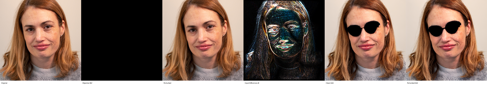

### VAE conditioning latent / face_002 / add headphones

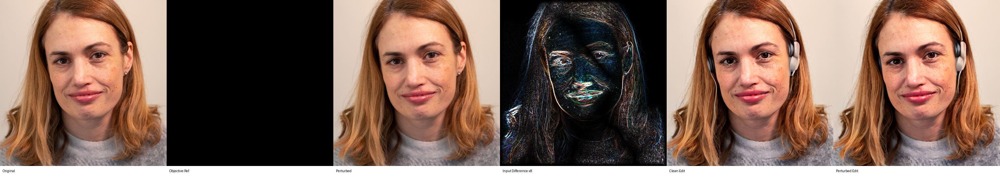

### VAE conditioning latent / face_005 / add black sunglasses

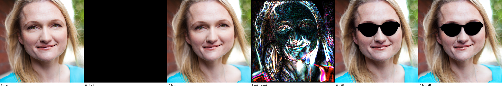

### VAE conditioning latent / face_005 / add headphones

### UNet denoising prediction / face_002 / add black sunglasses

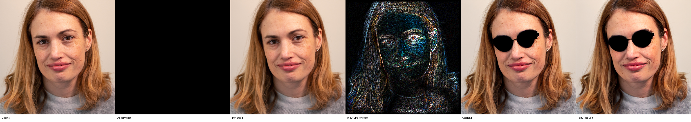

### UNet denoising prediction / face_002 / add headphones

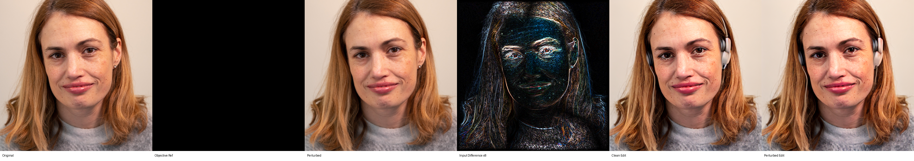

### UNet denoising prediction / face_005 / add black sunglasses

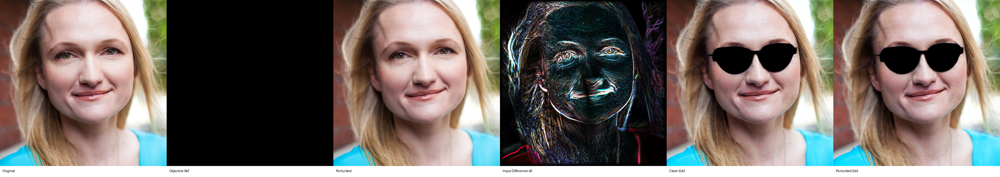

### UNet denoising prediction / face_005 / add headphones

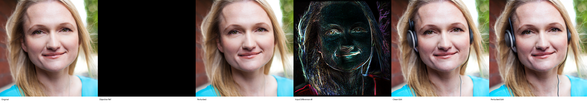

## Graphs

### VAE conditioning latent

#### VAE conditioning latent: Z vs iteration

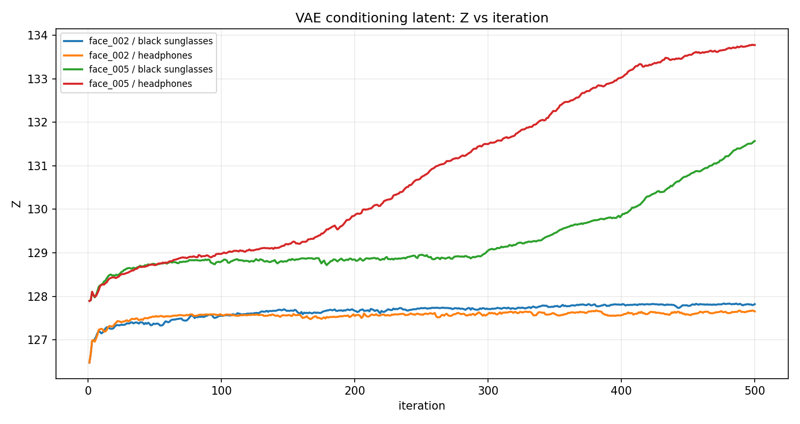

#### VAE conditioning latent: loss vs iteration

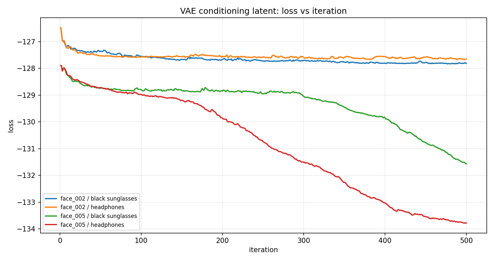

#### SSIM and PSNR to original

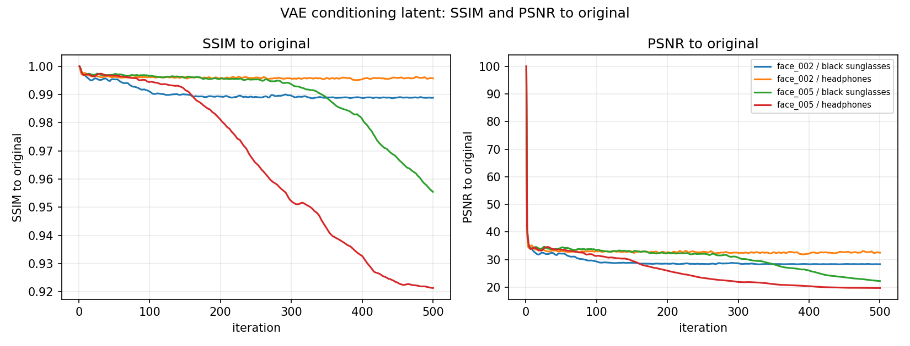

#### Geometry component contribution

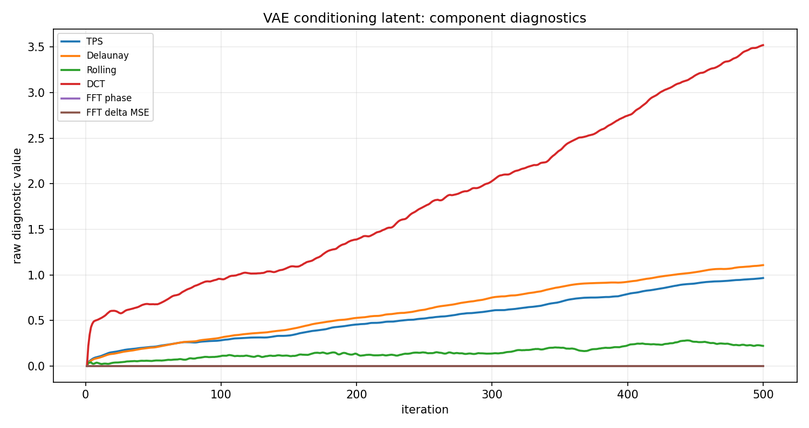

#### Geometry component contribution normalized

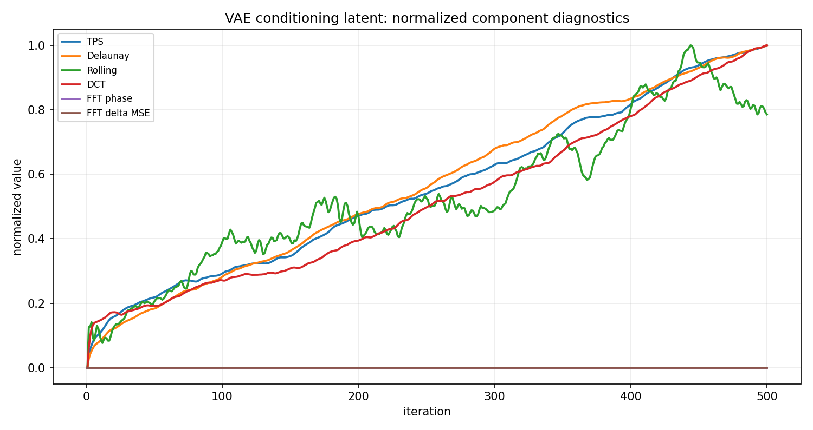

### UNet denoising prediction

#### UNet denoising prediction: Z vs iteration

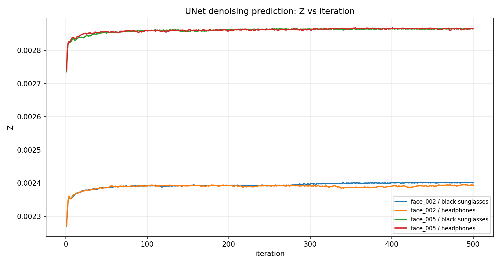

#### UNet denoising prediction: loss vs iteration

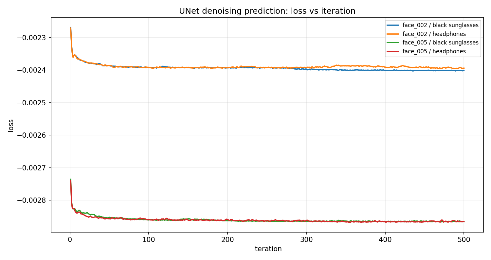

#### SSIM and PSNR to original

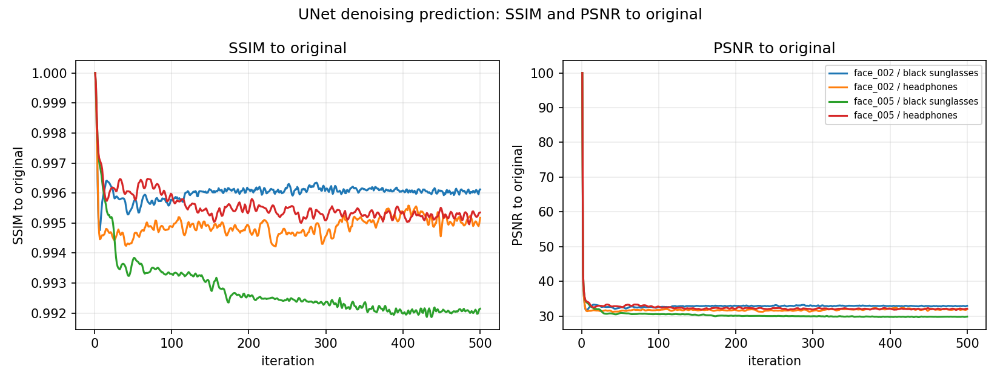

#### Geometry component contribution

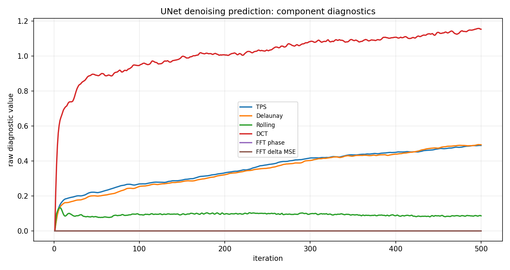

#### Geometry component contribution normalized

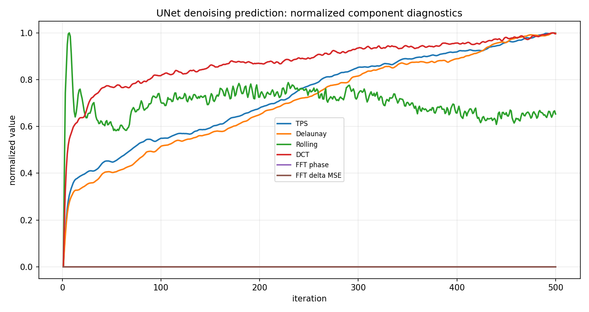
